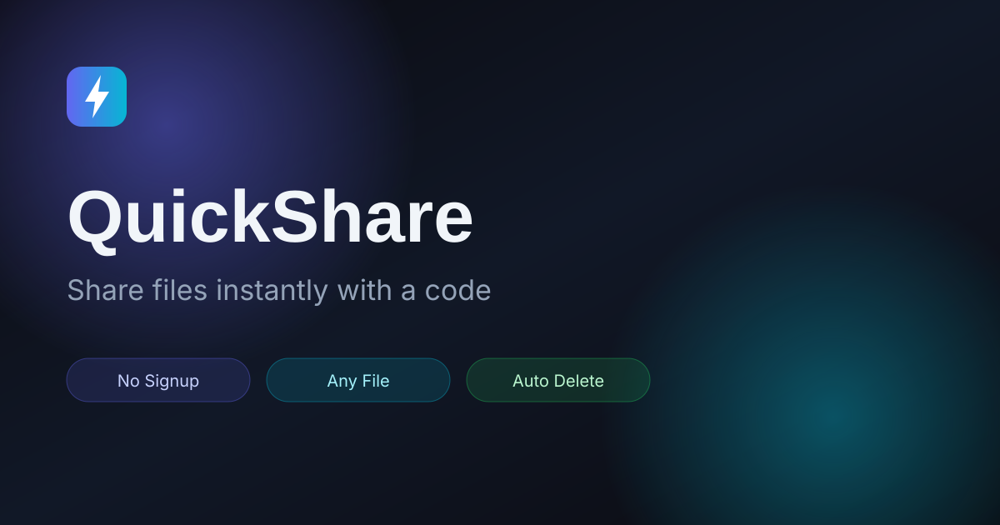

# ⚡ QuickShare

> Share files instantly with a code. No signup. No limits. Just a code.



## ✨ Features

- 📁 **Any file type** — Audio, video, document, image, archive (up to 100 MB)
- 📝 **Text sharing** — Copy-paste text transfer
- 🔑 **6-digit code** — Unique, easy to share
- 📱 **QR code** — Scan with phone
- 🔗 **Shareable link** — `https://yourdomain.com/r/123456`
- 👁️ **Inline preview** — Image, video, audio, PDF
- 📋 **One-click copy** — Code, link, text
- ⏱️ **Auto expiry** — Files deleted after 10 minutes
- 🎨 **Dark / Light theme** — Persist across sessions
- 📱 **Responsive** — Works on mobile, tablet, desktop
- 🔒 **No signup** — Anonymous, no tracking
- 🚀 **Socket.io** — Real-time receive notification

## 🛠️ Tech Stack

| Layer | Technology |
|-------|-----------|
| Frontend | HTML5, CSS3, Vanilla JS |
| Backend | Node.js, Express |
| Realtime | Socket.io |
| Upload | Multer (in-memory) |
| Security | Helmet, CORS, Rate limiting |

## 📋 Requirements

- Node.js v18 or higher
- npm or yarn

## 🚀 Installation

```bash
# Clone repo
git clone https://github.com/yourusername/quickshare.git
cd quickshare

# Install dependencies
npm install

# Setup environment
cp .env.example .env
# edit .env if needed

# Run development server
npm run dev

# Or production
npm start
```

Server runs at `http://localhost:3000`

## 📁 Project Structure

```
quickshare/
├── config/               # Constants
├── routes/               # API routes
├── controllers/          # Business logic
├── services/             # Storage, code gen, expiry
├── middlewares/          # Upload, rate limit, errors
├── utils/                # Helpers
├── public/               # Frontend
│   ├── css/              # Styles
│   ├── js/               # Scripts
│   ├── assets/           # Images, icons
│   └── libs/             # Third-party
├── storage/              # Temp files (dev)
├── server.js             # Entry
└── package.json
```

## 🔌 API Endpoints

| Method | Route | Description |
|--------|-------|-------------|
| POST | `/api/upload` | Upload file → returns code |
| POST | `/api/text` | Upload text → returns code |
| GET | `/api/info/:code` | Get transfer info |
| GET | `/api/download/:code` | Download file |
| GET | `/api/preview/:code` | Inline preview |
| GET | `/api/stats` | Public stats |
| GET | `/api/health` | Health check |

## ⚙️ Environment Variables

```env
PORT=3000
NODE_ENV=development
MAX_FILE_SIZE=104857600    # 100 MB
EXPIRY_MINUTES=10
RATE_LIMIT_WINDOW=15
RATE_LIMIT_MAX=100
BASE_URL=http://localhost:3000
```

## 🌐 Deploy

### Render.com (free)

1. Push code to GitHub
2. Go to [render.com](https://render.com) → New Web Service
3. Connect your repo
4. Settings:
   - **Build:** `npm install`
   - **Start:** `npm start`
5. Add environment variables (same as `.env`)
6. Deploy → done

### Railway.app

1. Push to GitHub
2. New Project → Deploy from repo
3. Add env vars
4. Deploy

## ⚠️ Notes

- Files are stored **in memory** — server restart clears all data
- Files auto-delete after 10 minutes
- For production, consider adding:
  - Persistent storage (S3, Cloudinary)
  - Database (MongoDB) for tracking
  - Redis for scalability
  - End-to-end encryption

## 📄 License

MIT © 2026 QuickShare
